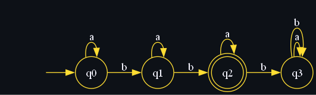
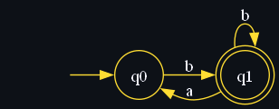
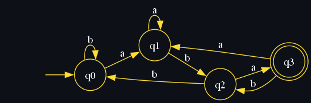
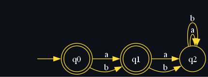
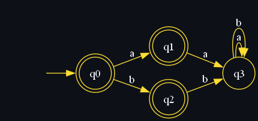
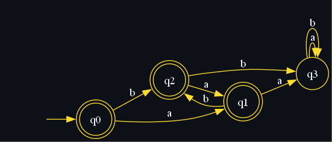
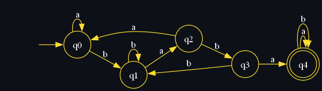
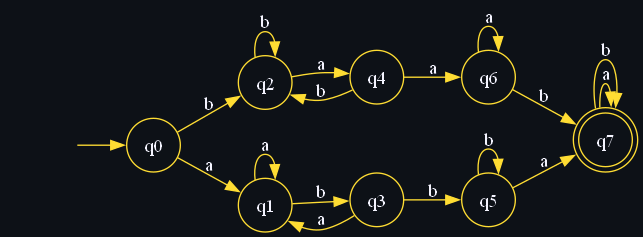
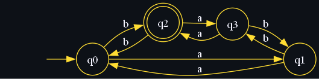

# Ejercicios

## 3.1 Construya el diagrama de transición para del **AFD** a partir de la siguiente tabla

| $\delta$ | 0   | 1   |
| -------- | --- | --- |
| -> \*q0  | q2  | q1  |
| q1       | q1  | q2  |
| q2       | q1  | q3  |
| q3       | q3  | q1  |

De la tabla anterior podemos inferir lo siguiente:
$Q = \{ q_0, q_1, q_2, q_3\}$
$\Sigma = \{0, 1\}$
$q_0 = q_0$
$F = \{q_0\}$

$$
\begin{align}
\delta = \{&(q_0, 0) = q_2, \\
&(q_0, 1) =  q_1, \\
&(q_1, 0) =  q_1, \\
&(q_1, 1) =  q_2, \\
&(q_2, 0) =  q_1, \\
&(q_2, 1) =  q_3, \\
&(q_3, 0) =  q_3, \\
&(q_3, 1) =  q_1 \\
\}
\end{align}
$$

## 3.2 Para los siguientes ejercicios construya el diagrama de transición del **AFD** que acepta cada uno de los lenguajes sobre el alfabeto $\Sigma = \{a, b\}$:

### a) El lenguaje donde toda cadena tiene exactamente dos *b*s

Primera iteración, mínima cadena aceptada por el autómata:
$\Sigma = \{a, b\}$
$Q = \{q_0, q_1, q_2\}$
$q_0 = q_0$
$F = q_2$
$\delta  = \{(q_0, b) = q_1, (q_1, b) = q_2\}$

Agregando los estados faltantes de *a*s:

$$
\begin{align}
\delta  = &\{    \\
&(q_0, a) = q_0, \\
&(q_0, b) = q_1, \\
&(q_1, a) = q_1, \\
&(q_1, b) = q_2, \\
&(q_2, b) = q_3, \\
&(q_2, a) = q_2, \\
&(q_3, a) = q_3, \\
&(q_3, b) = q_3  \\
\}
\end{align}
$$

También agregamos un cuarto estado:

Finalmente tenemos la siguiente descripción para el autómata

$\Sigma = \{a, b\}$
$Q = \{q_0, q_1, q_2, q_3\}$
$q_0 = q_0$
$F = q_2$

$$
\begin{align}
\delta  = &\{    \\
&(q_0, a) = q_0, \\
&(q_0, b) = q_1, \\
&(q_1, a) = q_1, \\
&(q_1, b) = q_2, \\
&(q_2, b) = q_3, \\
&(q_2, a) = q_2, \\
&(q_3, a) = q_3, \\
&(q_3, b) = q_3  \\
\}
\end{align}
$$

### b) El lenguaje de las cadenas no vacías, donde toda _a_ está entre dos *b*s

Cadena mínima aceptada por el autómata:

$\Sigma = \{a, b\}$
$Q = \{q_0, q_1\}$
$q_0 = q_0$
$F = q_1$

$$
\begin{align}
\delta  = &\{(q_0, b) = q_1, \\
&(q_1, a) = q_0, \\
&(q_1, b) = q_1 \\
\}
\end{align}
$$

Agregamos un estado de rechazo y agregamos las transiciones que faltan, finalmente la descripción del autómata sería la siguiente:
$\Sigma = \{a, b\}$
$q_0 = q_0$
$F = q_1$
$Q = \{q_0, q_1, q_2\}$

$$
\begin{align}
\delta  = &\{(q_0, a) = q_2 \\
&(q_0, b) = q_1, \\
&(q_1, a) = q_0, \\
&(q_1, b) = q_1 \\
&(q_2, a) = q_2, \\
&(q_2, b) = q_2 \\
\}
\end{align}
$$

### c) El lenguaje donde toda cadena contiene el sufijo _aba_.

Primera iteración, mínima cadena aceptada por el autómata:
$\Sigma = \{a, b\}$
$Q = \{q_0, q_1, q_2, q_3\}$
$q_0 = q_0$
$F = q_2$

$$
\begin{align}
\delta  = &\{(q_0, a) = q_1, \\
&(q_1, b) = q_0, \\
&(q_2, a) = q_0, \\
\}
\end{align}
$$

Agregando los estados faltantes además de otro estado:

$$
\begin{align}
\delta  = &\{(q_0, a) = q_1, \\
&(q_0, b) = q_0, \\
&(q_1, a) = q_1, \\
&(q_1, b) = q_2, \\
&(q_2, a) = q_3, \\
&(q_2, b) = q_0, \\
&(q_3, a) = q_1, \\
&(q_3, b) = q_2 \\
\}
\end{align}
$$

Definición final para este autómata:
$\Sigma = \{a, b\}$
$Q = \{q_0, q_1, q_2, q_3\}$
$q_0 = q_0$
$F = q_3$

$$
\begin{align}
\delta  = &\{(q_0, a) = q_1, \\
&(q_0, b) = q_0, \\
&(q_1, a) = q_1, \\
&(q_1, b) = q_2, \\
&(q_2, a) = q_3, \\
&(q_2, b) = q_0, \\
&(q_3, a) = q_1, \\
&(q_3, b) = q_2 \\
\}
\end{align}
$$

### d) El lenguaje donde ninguna cadena contiene las subcadenas _aa_ ni _bb_.

Primera iteración, mínimas cadenas aceptadas por el autómata:
$\Sigma = \{a, b\}$
$Q = \{q_0, q_1, q_2\}$
$q_0 = q_0$
$F = \{q_0, q_1\}$

$$
\begin{align}
\delta  = &\{(q_0, a) = q_1, \\
&(q_0, b) = q_1, \\
&(q_1, a) = q_2, \\
&(q_1, b) = q_2, \\
&(q_2, a) = q_2, \\
&(q_2, b) = q_2, \\
\}
\end{align}
$$

Para agregar las transiciones que faltan es necesario separar los estados para *a*s y para *b*s de la siguiente manera:
$Q = \{q_0, q_1, q_2, q_3\}$
$F = \{q_0, q_1, q_2\}$

$$
\begin{align}
\delta  = &\{(q_0, a) = q_1, \\
&(q_0, b) = q_2, \\
&(q_1, a) = q_3, \\
&(q_2, b) = q_3, \\
&(q_3, a) = q_3, \\
&(q_3, b) = q_3 \\
\}
\end{align}
$$

Ahora podemos agregar las transiciones faltantes:

$$
\begin{align}
\delta  = &\{(q_0, a) = q_1, \\
&(q_0, b) = q_2, \\
&(q_1, a) = q_3, \\
&(q_1, b) = q_2, \\
&(q_2, a) = q_1, \\
&(q_2, b) = q_3, \\
&(q_3, a) = q_3, \\
&(q_3, b) = q_3 \\
\}
\end{align}
$$

La descripción final para este autómata es la siguiente:

$\Sigma = \{a, b\}$
$q_0 = q_0$
$Q = \{q_0, q_1, q_2, q_3\}$
$F = \{q_0, q_1, q_2\}$

$$
\begin{align}
\delta  = &\{(q_0, a) = q_1, \\
&(q_0, b) = q_2, \\
&(q_1, a) = q_3, \\
&(q_1, b) = q_2, \\
&(q_2, a) = q_1, \\
&(q_2, b) = q_3, \\
&(q_3, a) = q_3, \\
&(q_3, b) = q_3 \\
\}
\end{align}
$$

### e) El lenguaje donde toda cadena contiene la subcadena _baba_

Cadena mínima para el autómata:
$\Sigma = \{a, b\}$
$q_0 = q_0$
$Q = \{q_0, q_1, q_2, q_3, q_4\}$
$F = \{q_4\}$

$$
\begin{align}
\delta  = &\{(q_0, b) = q_1, \\
&(q_1, a) = q_2, \\
&(q_2, b) = q_3, \\
&(q_3, a) = q_4, \\
&(q_4, a) = q_4, \\
&(q_4, b) = q_4  \\
\}
\end{align}
$$

Agregando las transiciones faltantes:

$$
\begin{align}
\delta  = &\{(q_0, a) = q_0, \\
&(q_0, b) = q_1, \\
&(q_1, a) = q_2, \\
&(q_1, b) = q_1, \\
&(q_2, a) = q_0, \\
&(q_2, b) = q_3, \\
&(q_3, a) = q_4, \\
&(q_3, b) = q_1, \\
&(q_4, a) = q_4, \\
&(q_4, b) = q_4  \\
\}
\end{align}
$$

Finalmente, la descripción completa del autómata es la siguiente:
$\Sigma = \{a, b\}$
$q_0 = q_0$
$Q = \{q_0, q_1, q_2, q_3, q_4\}$
$F = \{q_4\}$

$$
\begin{align}
\delta  = &\{(q_0, a) = q_0, \\
&(q_0, b) = q_1, \\
&(q_1, a) = q_2, \\
&(q_1, b) = q_1, \\
&(q_2, a) = q_0, \\
&(q_2, b) = q_3, \\
&(q_3, a) = q_4, \\
&(q_3, b) = q_1, \\
&(q_4, a) = q_4, \\
&(q_4, b) = q_4  \\
\}
\end{align}
$$

### f) El lenguaje donde toda cadena contiene por separado a las cadenas _ab_ y _ba_

$\Sigma = \{a, b\}$
$q_0 = q_0$
$Q = \{q_0, q_1, q_2, q_3, q_4, q_5, q_6, q_7\}$
$F = \{q_7\}$

$$
\begin{align}
\delta  = &\{(q_0, a) = q_1, \\
&(q_0, b) = q_2, \\
&(q_1, b) = q_3, \\
&(q_2, a) = q_4, \\
&(q_3, b) = q_5, \\
&(q_4, a) = q_6, \\
&(q_5, a) = q_7, \\
&(q_6, b) = q_7, \\
&(q_7, a) = q_7, \\
&(q_7, b) = q_7  \\
\}
\end{align}
$$

Primera iteración:

Agregamos las transiciones que faltan para cada estado:

$$
\begin{align}
\delta  = &\{(q_0, a) = q_1, \\
&(q_0, b) = q_2, \\
&(q_1, a) = q_1, \\
&(q_1, b) = q_3, \\
&(q_2, a) = q_4, \\
&(q_2, b) = q_2, \\
&(q_3, a) = q_1, \\
&(q_3, b) = q_5, \\
&(q_4, a) = q_6, \\
&(q_4, b) = q_2, \\
&(q_5, a) = q_7, \\
&(q_5, b) = q_5, \\
&(q_6, a) = q_6, \\
&(q_6, b) = q_7, \\
&(q_7, a) = q_7, \\
&(q_7, b) = q_7  \\
\}
\end{align}
$$

La descripción final del autómata es la siguiente:
$\Sigma = \{a, b\}$
$q_0 = q_0$
$Q = \{q_0, q_1, q_2, q_3, q_4, q_5, q_6, q_7\}$
$F = \{q_7\}$

$$
\begin{align}
\delta  = &\{(q_0, a) = q_1, \\
&(q_0, b) = q_2, \\
&(q_1, a) = q_1, \\
&(q_1, b) = q_3, \\
&(q_2, a) = q_4, \\
&(q_2, b) = q_2, \\
&(q_3, a) = q_1, \\
&(q_3, b) = q_5, \\
&(q_4, a) = q_6, \\
&(q_4, b) = q_2, \\
&(q_5, a) = q_7, \\
&(q_5, b) = q_5, \\
&(q_6, a) = q_6, \\
&(q_6, b) = q_7, \\
&(q_7, a) = q_7, \\
&(q_7, b) = q_7  \\
\}
\end{align}
$$

### g) Toda cadena es de longitud impar y contiene una cantidad par de *a*s

$\Sigma = \{a, b\}$
$q_0 = q_0$
$Q = \{q_0, q_1, q_2, q_3\}$
$F = \{q_2\}$

$$
\begin{align}
\delta  = &\{(q_0, b) = q_1, \\
&(q_1, a) = q_2, \\
&(q_2, b) = q_3, \\
&(q_3, a) = q_4, \\
&(q_4, a) = q_4, \\
&(q_4, b) = q_4  \\
\}
\end{align}
$$

