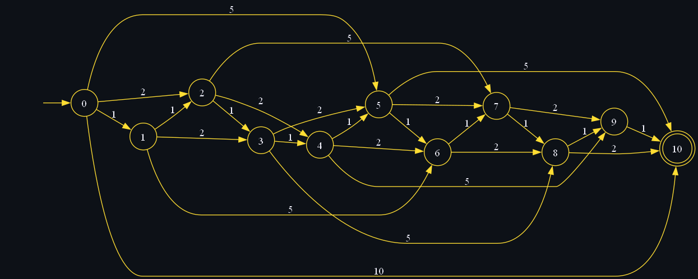

# Caso real de un autómata

Dentro de los ejemplos más communes para los autómatas finitos son las máquinas expendedoras, cajeros, switches, etc., pero uno con el que probablemente interactuamos seguidamente es con la estación del TuzoBus, la cual cuenta con un torniquete de acceso que funciona ya sea con la tarjeta del servicio o con monedas.

Para ejemplificar el funcionamiento de este autómata nos centraremos en la función con monedas.

Haciendo un análisis sobre el mismo vemos que tiene dos estados principales: "Cerrado" y "Abierto", pudiendo entre cualquiera de estos estados aceptar una moneda de 1, 2, 5 o 10 pesos.

Cada que insertamos una moneda el autómata cambia su estado para representar la cantidad de dinero que se ha insertado.

Una vez se alcance la cantidad de 10 pesos el autómata permite la entrada a la estación.

El alfabeto del autómata entonces son los valores de las monedas, los estados es la cantidad de dinero que se ha insertado:

$\Sigma = \{1, 2, 5, 10\}$

$Q = \{0, 1, 2, 3, 4, 5, 6, 7, 8, 9, 10\}$

Las transiciones se dan por cada moneda que podemos introducir al sistema para llegar a la suma de 10:

```math
\begin{align}
\delta &= \{ \\
&(0, 1) = 1, \\
&(1, 1) = 2, \\
&(2, 1) = 3, \\
&(3, 1) = 4, \\
&(4, 1) = 5, \\
&(5, 1) = 6, \\
&(6, 1) = 7, \\
&(7, 1) = 8, \\
&(8, 1) = 9, \\
&(9, 1) = 10, \\
&(0, 2) = 2, \\
&(2, 2) = 4, \\
&(4, 2) = 6, \\
&(6, 2) = 8, \\
&(8, 2) = 10, \\
&(1, 2) = 3, \\
&(3, 2) = 5, \\
&(5, 2) = 7, \\
&(7, 2) = 9, \\
&(0, 5) = 5, \\
&(5, 5) = 10, \\
&(1, 5) = 6, \\
&(2, 5) = 7, \\
&(3, 5) = 8, \\
&(4, 5) = 9, \\
&(0, 10) = 10 \\
&\}
\end{align}
```

Por último, el estado inicial es siempre empezar en 0, y el estado final es cuando se llega a la suma de 10:

$q_0 = 0$

$F = \{10\}$

El grafo que representa este autómata es el siguiente:



Para este diseño decidimos omitir las transiciones que sobrepasan a la suma de 10 por simplicidad, además de que en la implementación actual, cualquier valor mayor de 10 sigue siendo un estado de aceptación.

# Conclusión

Los autómatas finitos tienen muchas aplicaciones dentro y fuera de las ciencias computacionales y nos ayudan a simplificar las soluciones de problemas que de otra manera resultarían muy complejos de resolver, como puede ser este mismo ejemplo, en el que tendríamos que tener varias condiciones para saber cuál es el siguiente estado a partir de la moneda que se introdujo.
